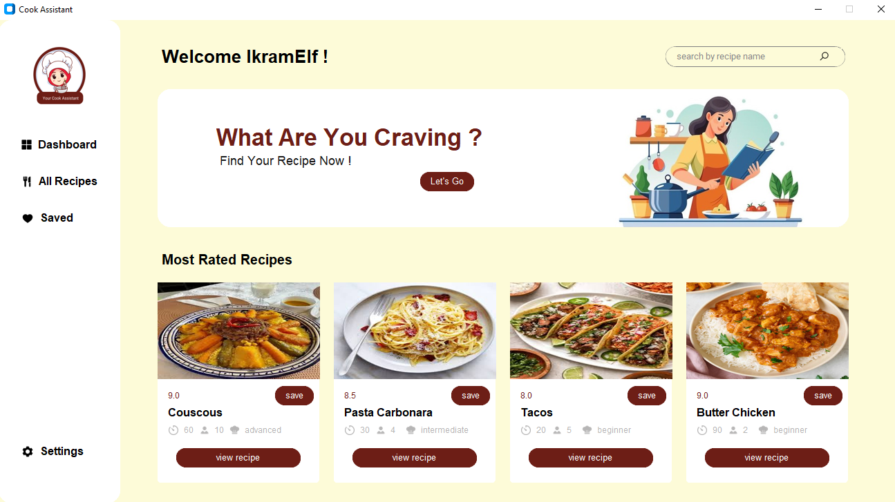

# Cook Assistance



A modern Python GUI application that helps users discover, search, and manage recipes with advanced filtering and personal collections.

##  Description

Cook Assistance is a desktop application built with Python and CustomTkinter that serves as your personal cooking companion. Users can search through extensive recipe databases, filter by various criteria, save favorite recipes, and manage their personal cooking profile with full authentication system.

##  Tech Stack

| Technology | Purpose |
|------------|---------|
| **Python 3** | Core programming language |
| **CustomTkinter** | Modern GUI framework with customizable widgets |
| **MongoDB** | Database for recipes and user data |
| **PyMongo** | MongoDB driver for Python integration |
| **Tkinter** | Base GUI toolkit |

##  Key Features

- Recipes Searching - Search recipes by name
- Smart Filtering - Filter by difficulty level, taste preferences, and cuisine type
- Save System - Save and unsave recipes to personal collection
- User Authentication - Create account, login functionality
- Modern GUI - Clean, light-themed interface using CustomTkinter
- Local Database - MongoDB backend for efficient data management

## Installation & Setup

### Prerequisites
- Python 3.8 or higher
- MongoDB installed and running locally
- pip (Python package manager)

### Installation Steps

```bash
# Clone the repository
git clone https://github.com/ikramelfrnani/cook_assistant_app.git
cd cook_assistant_app

# Install required packages
pip install customtkinter pymongo pillow

# Run the application
python src/main.py
```
##  Author

**Ikram El Frnani**
- **GitHub**: [@ikramelfrnani](https://github.com/ikramelfrnani)
- **LinkedIn**: [Ikram El Frnani](https://linkedin.com/in/ikram-el-frnani-9314a2201)  
- **Portfolio**: [ikramelfrnani.vercel.app](https://ikramelfrnani.vercel.app/)


